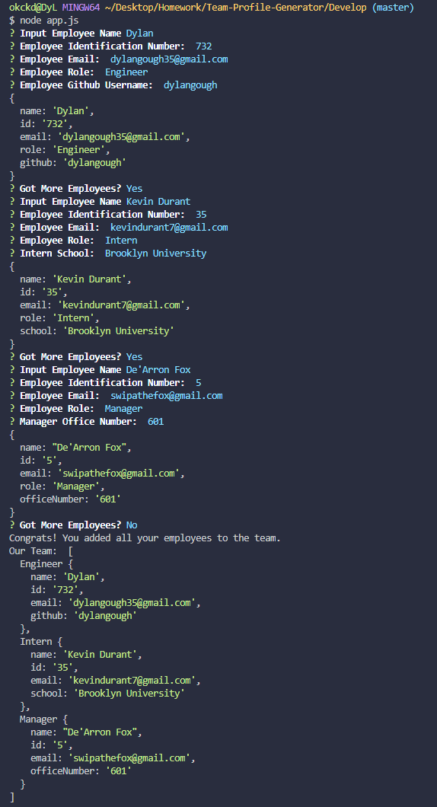
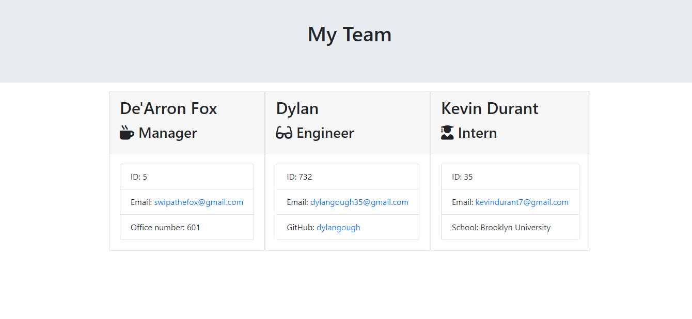

<h5>Rutgers Coding Bootcamp</h5>
<h1 align="center">Team Profile Generator</h1>

By Dylan Gough

<h2>What is this?</h2>

The team profile generator is a program that produces an HTML site that contains inputs from user generated content from the JavaScript program running. When first running the program you are presented with a series of questions that will eventually auto complete the input fields of the outputting HTML file.

 

<h2>Components</h2>

HTML | JavaScript | Node.JS

 

<h2>Install Process</h2>

* npm install jest
* npm install inquirer

<h3 align="right"><a href="https://github.com/dylangough/Team-Profile-Generator">Github Link</a></h3>
